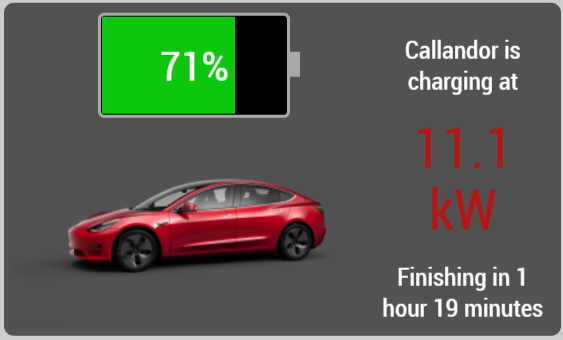
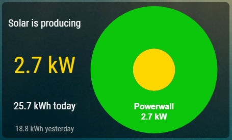
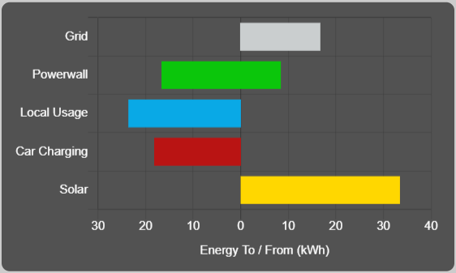
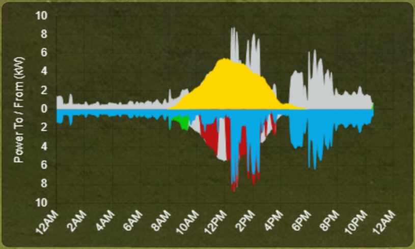

# MMM-Powerwall

This is a module for the
[MagicMirror²](https://github.com/MichMich/MagicMirror/).  It displays data from
your [Tesla Powerwall](https://www.tesla.com/powerwall) on your Magic Mirror,
optionally including car charging data pulled from your
[TWCManager](https://github.com/ngardiner/TWCManager/) (v1.2.0 or later).

If using all the graphs, this works best in one of the full-width positions
(`upper_third`, `middle_center`, `lower_third`); individual graphs can work
nicely in other positions.

## Using the module

To use this module, clone this repo into ~/MagicMirror/modules, run `npm
install` to get dependencies, and add the following configuration block to the
modules array in the `config/config.js` file:
```js
var config = {
    modules: [
        {
            module: 'MMM-Powerwall',
            position: 'lower_third',
            config: {
                // See below for configurable options
            }
        }
    ]
}
```

## Configuration options

| Option                | Description
|---------------------- |-----------
| `powerwallIP`         | *Required* IP address of the Powerwall endpoint to query
| `siteID`              | *Optional* if your Tesla account has exactly one energy site; required if multiple are present
| `twcManagerIP`        | *Optional* IP address or hostname of TWCManager instance; if omitted, Car Charging will not be displayed
| `twcManagerPort`      | *Optional* port of TWCManager's web interface; default is `8080`
| `graphs`              | *Optional* Array of tiles to show. Possible values are described below; default is all
| `localUpdateInterval` | *Optional* How often (in milliseconds) to poll local endpoints (Powerwall and TWCManager)<br>Default 10000 milliseconds (10 seconds)
| `cloudUpdateInterval` | *Optional* How often (in milliseconds) to poll Tesla API<br>Default 300000 milliseconds (five minutes)
| `teslaAPIUsername`    | *Recommended* Username for your Tesla account
| `teslaAPIPassword`    | *Optional* Password for your Tesla account; see below for more options
| `home`                | *Optional* Coordinates (`[lat, lon]`) of your home; used to indicate when car is at home and to get sunrise/sunset times

### Graphs

This module implements several different graphs.  Currently, these are:

- CarCharging<br>
- PowerwallSelfPowered<br>
- SolarProduction<br>
- HouseConsumption<br>
- EnergyBar<br>
- PowerLine<br>

By default, all are displayed.  However, as needed by your layout, you can
instantiate multiple instances of this module, each displaying different graphs
or even targeting different Powerwall systems.  All data is requested, cached,
and distributed by the node_helper, so multiple instances referencing the same
target will still update simultaneously and will not increase the volume of
requests made to either local or cloud endpoints.

### Authentication

This module relies on being able to access your Powerwall both locally and via
the Tesla API.  The local endpoint interactions require no authentication. To
authenticate to the Tesla API, you have two options:

- **Include your password in the module configuration.**
  Note that your password will be relayed from client to server at client
  start-up and MagicMirror2 does not use TLS by default, so use this option only
  if your only client is on the same device, or if you completely trust your
  local network.
- **Generate Tesla API tokens yourself.**
  Create a file named `tokens.json` in the module directory containing the
  following:

```
{"myusername@mydomain.net": <My token response>}
```
  ...where `<My token response>` is the entire object you get from the Tesla
  authentication API.  (You can use https://token.tesla-screen.com/ to get
  this.)

Alternatively, the module will generate `tokens.json` after the first successful
load with the password in the config.  You can remove the password from your
`config.js` file afterward, and it will continue to work (unless you change your
password, which invalidates all existing tokens).  If using multiple instances,
providing the password to any instance enables all instances to use it.

Neither the password nor the tokens are sent anywhere except from your client to
the node_helper, and thence to the Tesla API.

## Dependencies and Acknowledgements

This module relies on the following APIs:

- The Tesla Owner's API, picked apart at https://www.teslaapi.io/
- The Tesla Compositor API, picked apart at https://teslaownersonline.com/threads/teslas-image-compositor.7089/
- The Powerwall local API, picked apart at https://github.com/vloschiavo/powerwall2
- The TWCManager local API, documented at https://github.com/ngardiner/TWCManager/blob/v1.2.0/docs/modules/Control_HTTP.md
- The Sunrise Sunset API, documented at https://sunrise-sunset.org/api
- The ArcGIS Reverse Geocode API, documented at https://developers.arcgis.com/rest/geocode/api-reference/geocoding-reverse-geocode.htm
- Powerline icon made by [Freepik](https://www.flaticon.com/authors/freepik) from https://www.flaticon.com/

In addition to any commiters to the repo, the following have helped figure certain pieces out:

- @ngardiner's work on TWCManager is amazing, and the car charging could not be tracked without it
- @Kemmey provided initial code for interacting with the compositor